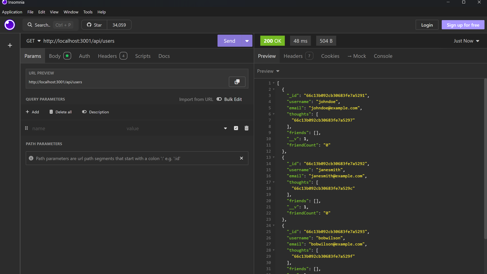
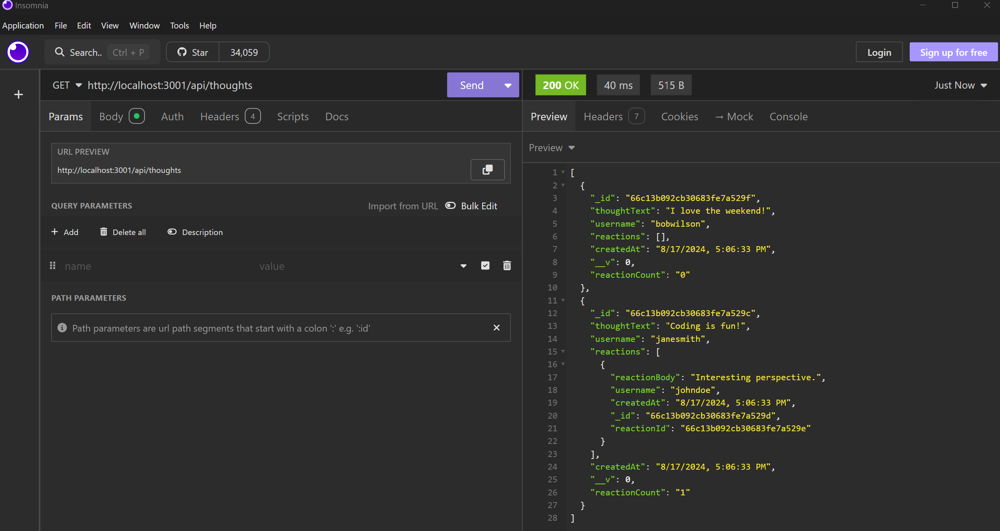
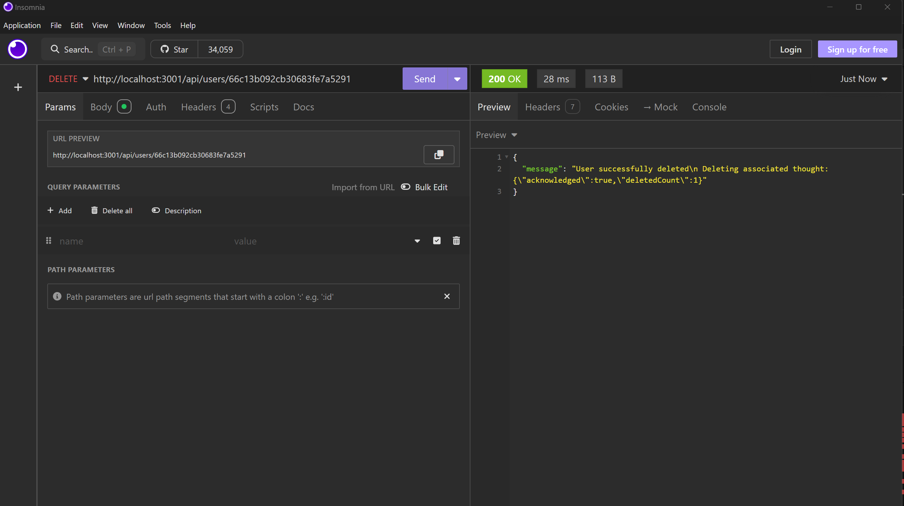
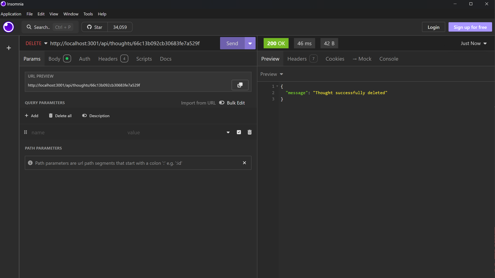

  # 18_Social_Network_API

  ## Description

    This is the back-end api of a social network. A user and thought can be created, updated and deleted. Whenever a user is deleted the associated thought or thoughts is/are also deleted. A user can also add and delete friends. Thoughts can also be attached with reaction as well as delete reactions.

  ## Table of Contents 

  - [Installation](#installation)
  - [Usage](#usage)
  - [Screenshots](#screenshots)
  - [License](#license)

  ## Installation

    Make sure mongodb is installed. Run the command npm install. Run the command npm run seed. Run the command npm run start. Open up Insomnia to make the appropriate requests.

  ## Usage

    Navigate to the following routes and make the appropriate GET, POST, PUT, and DELETE requests.
    - api/users
    - api/users/:userId
    - api/users/:userId/friends/:friendId
    - api/thoughts
    - api/thoughts/:thoughtsId
    - api/thoughts/:thoughtsId/reactions
    - api/thoughts/:thoughtsId/reactions/:reactionId

  ### Video Tutorial
  
  [Click Here](https://youtu.be/JX9utb2OV-k)
  
  ## Screenshots

    This is a get request example of the user table
  

    This is a get request example of the thought table.
  

    This is a delete request example of the user table.
  

    This is a delete request example of the thought table.
  

  ## License 
  ### Badge 
  

    
      MIT License

      Copyright (c) function getFullYear() { [native code] } 
      
      Permission is hereby granted, free of charge, to any person obtaining a copy
      of this software and associated documentation files (the "Software"), to deal
      in the Software without restriction, including without limitation the rights
      to use, copy, modify, merge, publish, distribute, sublicense, and/or sell
      copies of the Software, and to permit persons to whom the Software is
      furnished to do so, subject to the following conditions:
      
      The above copyright notice and this permission notice shall be included in all
      copies or substantial portions of the Software.
      
      THE SOFTWARE IS PROVIDED "AS IS", WITHOUT WARRANTY OF ANY KIND, EXPRESS OR
      IMPLIED, INCLUDING BUT NOT LIMITED TO THE WARRANTIES OF MERCHANTABILITY,
      FITNESS FOR A PARTICULAR PURPOSE AND NONINFRINGEMENT. IN NO EVENT SHALL THE
      AUTHORS OR COPYRIGHT HOLDERS BE LIABLE FOR ANY CLAIM, DAMAGES OR OTHER
      LIABILITY, WHETHER IN AN ACTION OF CONTRACT, TORT OR OTHERWISE, ARISING FROM,
      OUT OF OR IN CONNECTION WITH THE SOFTWARE OR THE USE OR OTHER DEALINGS IN THE
      SOFTWARE.
      

  https://choosealicense.com/licenses/mit/
  

  